# Ceph

[toc]

## ceph介绍

分布式存储系统

* 可靠
* 自动重均衡
* 自动恢复

使用场景：对象存储、块存储、文件系统存储。其中在虚拟化领域比较常用的是块设备存储。

相比于其他的存储，Ceph还充分利用了存储节点的计算能力。通过计算得出每块数据的存储位置，尽量的将数据均衡分布。采用了CRUSH、HASH环算法等，不存在单点故障的问题，且随着规模的扩大性能不会受到影响。

## Ceph核心组件

一个Ceph集群至少需要一个Ceph Monitor，一个Ceph Manager，和一个Ceph OSD。运行Ceph文件系统客户端的时候还需要Ceph MDS。

* Ceph OSD
  对象存储守护程序（ceph-osd）通过检查其他Ceph OSD守护程序的心跳来存储数据，处理数据复制，恢复，重新平衡，并向Ceph监视器和管理器提供一些监视信息。 通常至少需要3个Ceph OSD才能实现冗余和高可用性。 
  Journal盘 SSD

* Ceph Monitor
  维护集群状态的映射，包括监视器映射，管理器映射，OSD映射，MDS映射和CRUSH映射。 这些映射是Ceph守护程序相互协调所需的关键群集状态。 监视器还负责管理守护程序和客户端之间的身份验证。 通常至少需要三个监视器才能实现冗余和高可用性。 

* Ceph Manager
  守护进程（ceph-mgr）负责跟踪运行时指标和Ceph集群的当前状态，包括存储利用率，当前性能指标和系统负载。 Ceph Manager守护程序还托管基于python的模块，以管理和公开Ceph集群信息，包括基于Web的Ceph仪表板和REST API。 高可用性通常至少需要两个管理器。 

* Ceph MDS
  Ceph元数据服务器（MDS，ceph-mds）代表Ceph文件系统存储元数据（即Ceph块设备和Ceph对象存储不使用MDS）。 Ceph元数据服务器允许POSIX文件系统用户执行基本命令（如ls，find等），而不会给Ceph存储集群带来巨大负担。 

  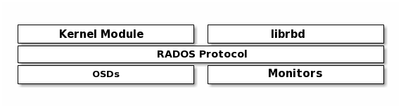

Ceph的块设备可为内核模块或QVM等KVM和依赖libvirt和QEMU与Ceph块设备集成的基于云的计算系统（如OpenStack和CloudStack）提供无限扩展性。 您可以使用同一群集同时操作Ceph RADOS网关，Ceph文件系统和Ceph块设备。 

 Ceph将数据作为对象存储在逻辑存储池中。 使用CRUSH算法，Ceph计算哪个放置组应包含该对象，并进一步计算哪个Ceph OSD守护程序应存储该放置组。 CRUSH算法使Ceph存储集群能够动态扩展，重新平衡和恢复。 

## Ceph架构


一个Ceph集群中存在两种Daemon守护程序：

* Ceph Monitor
* Ceph OSD Daemon


Ceph Monitor维护了一个集群映射的主副本，创建Monitor集群可以实现其高可用。存储集群客户端从Ceph Monitor 检索集群映射的副本。

Ceph OSD Daemon检查自己和其他OSD的状态并报告给Monitor。

存储集群客户端和每个Ceph OSD Daemon都使用CRUSH算法来有效地计算有关数据位置的信息，而不必依赖中央查找表。 Ceph的高级功能包括通过librados提供到Ceph存储集群的本机接口，以及在librados之上构建的许多服务接口。 

### 数据存储

无论是何种方式实现的Ceph集群，都需要从Ceph客户端接收数据并将其存储为Objects。每一个Object对应文件系统中的一个文件，这个文件存储在一个对象存储设备中。Ceph OSD Daemon处理存储磁盘上的读写操作。

Ceph OSD Daemon将所有数据存储在一个扁平的命名空间中（指没有目录结构）。一个object具有一个标识符，二进制数据以及由一组name/value键值对组成的元数据。语义完全取决于Ceph客户端。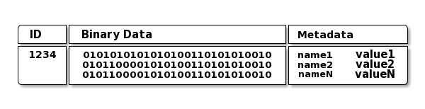

标识符(ID)在整个集群中都是唯一的。

### 可伸缩性和高可用性

在传统架构中，客户端与一个集中式的组件（网关、API、代理等等）进行通信，该组件充当复杂子系统的单个入口点，这不仅引入了单点故障，同时也对集群性能和可伸缩性都施加了限制。Ceph消除了集中式的网关，使客户端和Ceph OSD Daemon直接进行交互。Ceph OSD Daemon在其他的Ceph Node上创建对象副本，以确保数据安全和高可用性。Ceph还通过建立Monitor集群来保证高可用性。

#### CRUSH算法介绍

Ceph客户端和Ceph OSD Daemon都使用了CRUSH算法来有效的计算object的位置，而不必去依赖中央查找表。 与旧方法相比，CRUSH提供了更好的数据管理机制，并且通过将工作干净地分配给集群中的所有客户端和OSD守护程序来实现大规模扩展。 CRUSH使用智能数据复制来确保弹性，该弹性更适合于超大规模存储。 

#### 集群映射

Ceph需要确保Ceph客户端和Ceph OSD Daemon 了解集群的拓扑结构，包括下列五个映射关系，统称为“集群映射（Cluster Map）”。

1. **Monitor Map** 包含了集群的`fsid`，每个Monitor的位置，名称地址和端口。它还指示了当前的阶段（epoch），创建map的时间和最后一次修改的时间。执行`ceph mon dump`查看monitor map。
   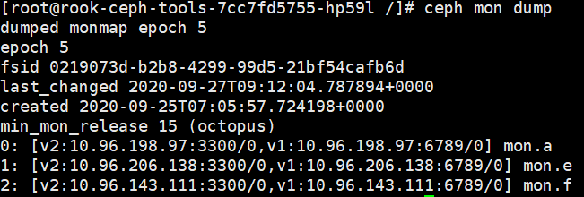
2. **OSD Map** 包含了集群的`fsid`，map创建和最后一次修改的时间，一个pool的list，副本的大小，PG的数量，一个OSD及其状态的list。执行`ceph osd dump`查看OSD map。
   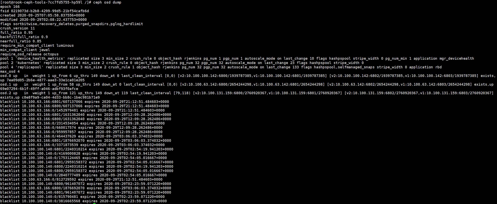
3. **PG Map** 包含了PG版本，时间戳，last_osdmap_epoch，每个PG的详细信息，例如PG ID，Up Set，Acting Set，PG的状态（例如，active + clean）以及每个池的数据使用统计信息。 执行`ceph pg dump`查看
   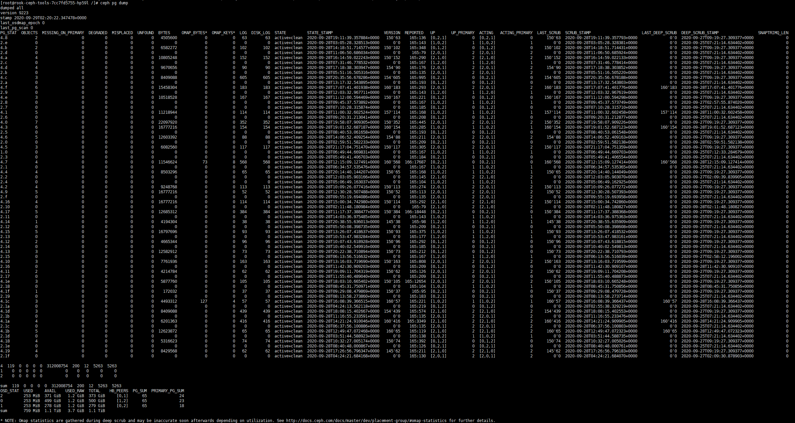
4. **CRUSH Map** 包含了存储设备的列表，故障域（failure domain）层级结构（例如device，host，rack，row，room等） 和在存储数据时遍历层级结构的规则。查看CRUSH Map需要先执行`ceph osd getcrushmap -o {filename}`，再执行`crushtool -d {comp-crushmap-filename} -o {decomp-crushmap-filename} `，查看解压后的文件既是CRUSH map的内容。
5. **MDS Map** 包含了当前的MDS map epoch，map创建的时间，上一次修改的时间。同时还包含了用于存储元数据的池，元数据服务器列表和当前哪些元数据服务器的状态是`up`和`in`。执行`ceph fs dump`查看 MDS Map。

### 动态集群管理

#### Pool

Ceph客户端从Ceph Monitor中获取Cluster Map，将objects写入到pool中。Pool的大小、副本的数量、CRUSH规则和PG的数量决定了Ceph如何放置数据。

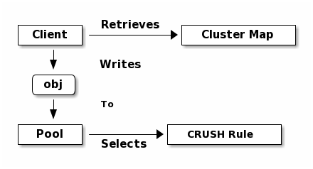

对于Pool来说，至少设置下列三个参数：

* 对Objects的所有权/访问权
* PG的数量
* 使用的CRUSH规则

#### 将PG映射到OSD

每个Pool都有一定数量的PG。CRUSH动态的将PG映射到多个OSD中。当Ceph客户端存储Object的时候，会将每个Object映射到一个PG中。


#### 计算要放置的PG的ID

当Ceph客户端绑定了Ceph Monitor，它会取得最新的Cluster Map副本。通过这个副本，客户端可以知道集群中所有的Monitors，OSD和元数据服务器。但是对object存放的位置一无所知。

（1）Client输入Pool名称和对象ID；

（2）获得对象ID并对其进行Hash运算；

（3）Hash取模获得PG的ID，比如48；

（4）取得该Pool的ID，比如是1；

（5）优先考虑到Pool ID相同的PG ID，比如1.48。

在对话频繁的Session中，计算object位置比执行object位置查询要快的多。CRUSH算法允许客户端计算object应该存放的位置，并且允许客户端访问住OSD来存储或检索对象。

#### Peering和Sets

Ceph OSD Daemon互相检查心跳并且报告给Ceph Monitor。Ceph OSD Daemon做的另外一件事被称为`Peering`，这是使PG的所有OSD在关于这个PG内的object（和元数据）的状态上达成一致。

Ceph集群数据安全的最低要求是对每个object至少存储两份副本（size = 2）。高可用的要求是存储多于两份副本（size = 3, min size = 2），这样可以保证在降级的情况下同样可以保证数据安全。

Ceph OSD Daemons在每个PG中被分为`Primary`、`Secondary`、`Tertiary`、`Quaternary`等等，通常下情况下`Primary`是`Acting Set`（一组为PG负责的OSD）的第一个OSD，它负责协调`Peering `过程，并且是唯一一个能够接受客户端发起的对PG的写操作的OSD。

`Acting Set`中的部分OSD Daemons的状态并不一定一直是`up`。当状态是`up`的时候，这个OSD也是`Up Set`中的一部分。Ceph可以依据`Up Set`来将PG进行重新映射。

#### Rebalancing

添加新的OSD到集群中时，Cluster map会发生更新，计算PG ID的结果也会发生变化，最终会影响object放置的位置。（这种影响在大型Ceph集群中比较微小。）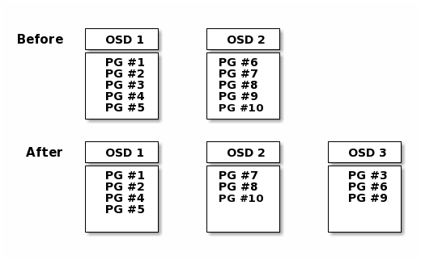

#### Data Consistency

为了保持数据一致性和清洁度，Ceph OSD还可以对PG中的objects进行数据清洗。Ceph OSDs将一个PG中的object元数据与其他PG（存储在其他的OSD中）进行对比。数据清洗（Scrubbing，通常每天一次）捕获OSD中的错误或者文件系统的错误。深度清洗（Deep Scrubbing，通常每周一次）会发现在轻度清洗中不容易发现的磁盘坏扇区等错误。

[数据清洗Scrubbing参数设置](https://docs.ceph.com/en/latest/rados/configuration/osd-config-ref/#scrubbing)

### Erasure Coding（纠删编码）

每个纠删编码池将数据存储成为K+M个块，其中K个数据块和M个编码块，每个块被存储在`Acting Set`中的OSD中，块的等级作为object的属性也被存储起来。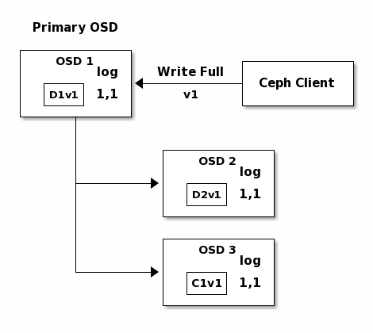

具体的纠删码原理参考：[纠删编码简介]( https://www.cnblogs.com/Robin5/p/11710005.html )

#### 读取和写入编码块

以一个使用了5个OSD（K + M = 5）的纠删编码池为例，它能够容忍两个数据块失效（M = 2）。

shard_t是块被创建的顺序：NYAN1、NYAN2、NYAN3、NYAN4、NYAN5

其中4和5是纠删编码块。

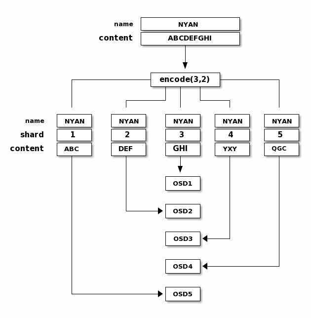

从纠删编码池中读取数据的时候，可以通过任意三个块来获得原始数据，例如下图中OSD4（存储了NYAN5）失效，OSD2（存储了NYAN2）读取速度过慢，通过从OSD1、OSD3、OSD5中读取NYAN1、NYAN3、NYAN4的数据，恢复出了原始的数据NYAN。

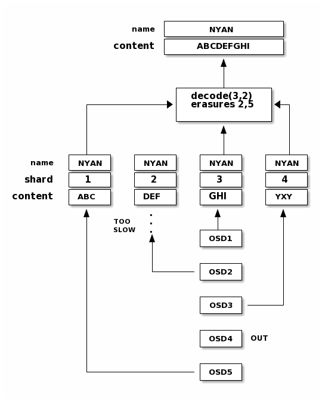

### Cache Tiering（缓存分层）

缓存层的存在为Ceph客户端存储在后端存储层的部分数据提供了更好的I/O性能。缓存分层涉及创建一个作为缓存层的相对较快/昂贵的存储设备（如SSD）的池，以及作为经济存储层的纠删编码或相对更慢/便宜的后端设备池。Ceph objecter处理放置object的位置，分层代理来确定何时将object从缓存刷新到后备存储层。关于更多缓存分层的细节，查阅[Cache Tiering](https://docs.ceph.com/en/latest/rados/operations/cache-tiering)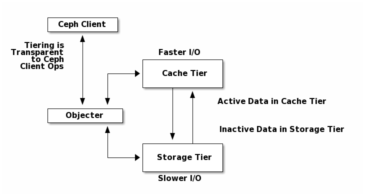

## Ceph 块设备

### 常用的基本命令

`rbd`命令可以创建、显示、内部修改和移除块设备镜像，同时还可以克隆镜像、创建快照、将镜像回滚至特定快照、查看快照等等。详细的命令说明请看[RBD命令](https://docs.ceph.com/en/latest/man/8/rbd/)

#### 创建块设备池

1. 在管理节点，使用`ceph`工具创建一个池

2. 在管理节点，使用`rbd`工具初始化

   ```shell
   rbd pool init <pool-name>
   ```

   > 如果不提供池的名称，则默认为rbd

#### 创建块设备用户

在未指定的情况下，rbd命令使用ID:admin来访问Ceph集群。这个ID拥有对Ceph集群的完全管理权限。

创建Ceph user使用`ceph`声明`auth get-or-create`命令

```shell
ceph auth get-or-create client.{ID} mon 'profile rbd' osd 'profile {profile name} [pool={pool-name}][, profile ...]' mgr 'profile rbd [pool={pool-name}]'
```

> 使用`rbd`命令时，指定`--id {id}`来使用相应的用户权限

#### 创建块设备镜像

在添加块设备到一个节点前，需要首先在Ceph存储集群中为其创建一个镜像。

```shell
rbd create --size {megabytes} {pool-name}/{image-name}
```

#### 列出块设备镜像

```shell
rbd ls {poolname}
```

列出延迟删除块设备命令为：

```shell
rbd trash ls {poolname}
```

#### 获取镜像的信息

```shell
rbd info {pool-name}/{image-name}
```

#### 调整块设备镜像的大小

由于Ceph块设备镜像是精简配置的，在实际存储数据之前不使用任何的物理存储。但是它们有通过`--size`设置的最大容量限制，如果你希望增大或减小某个块设备的最大容量，执行下面的命令：

```shell
#增大
rbd resize --size 2048 foo
#减小
rbd resize --size 2048 foo --allow-shrink
```

#### 移除块设备镜像

```shell
rbd rm {pool-name}/{image-name}
```

 要推迟从池中删除块设备

```shell
rbd trash mv {pool-name}/{image-name}
```

要删除一个延迟删除的块设备，使用image-id

```shell
rbd trash rm {pool-name}/{image-id}
```

> * 即使块设备镜像有快照存在，你仍让可以将它移动到trash中，但是无法将它从trash中移除
> * 可以使用`--expires-at`指定延迟时间（默认是`now`），如果在指定时间内没有过期，则无法被移除，除非指定了`--force`

#### 恢复块设备镜像

要恢复某个池中的延迟删除设备

```shell
rbd trash restore {pool-name}/{image-id}
```

可以通过指定`--image`来重命名恢复后的镜像

```shell
rbd trash restore {pool-name}/{image-id} --image new-name
```

### 块设备相关操作

#### Snapshots 快照

快照是特定时间点上的镜像状态的只读副本。

```shell
#创建Snapshot
rbd snap create {pool-name}/{image-name}@{snap-name}

#列出Snapshots
rbd snap ls {pool-name}/{image-name}

#回滚Snapshot
rbd snap rollback {pool-name}/{image-name}@{snap-name}

#删除Snapshot
rbd snap rm {pool-name}/{image-name}@{snap-name}

#清空Snapshot
rbd snap purge {pool-name}/{image-name}
```

克隆快照的流程如下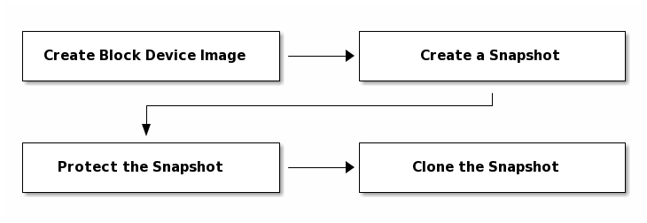

```shell
#保护Snapshot
rbd snap protect {pool-name}/{image-name}@{snapshot-name}

#克隆snapshot
rbd clone {pool-name}/{parent-image}@{snap-name} {pool-name}/{child-image-name}

#取消保护Snapshot
rbd snap unprotect {pool-name}/{image-name}@{snapshot-name}

#列出一个Snapshot的子对象
rbd children {pool-name}/{image-name}@{snapshot-name}

#平整（flatten）克隆的镜像
#克隆的镜像保留着对父快照的引用，当需要从子克隆中删除对父快照的引用时，可以通过将信息从快照复制到克隆中来有效的“平整”镜像。
rbd flatten {pool-name}/{image-name}
```

#### RBD排他锁

排他锁是一个用来防止多个进程以不协调的方式同时访问同一个Rados块设备（RBD）的机制。 排他锁在虚拟化（防止VM破坏彼此的写入）和RBD映射（它们是日志的前提）中大量使用。 

除非通过副高`rbd_default_features`配置选项或`rbd create`命令的`--image-feature`标志指定，默认情况下下会在新创建的镜像上启用排他锁。

排他锁对于用户来说几乎是完全透明的：

1.  每当任何librbd客户端进程或内核RBD客户端开始使用已启用了排他锁的RBD镜像时，它都会在首次写入之前获得镜像上的排他锁。 
2. 每当任何这样的客户端进程优雅终止时，它都会自动的释放这个锁。
3. 这样就就可以让另一个进程获取锁并对镜像进行写操作。

> 注意，两个或两个以上同时运行的进程完全可以仅打开镜像并从中读取数据。客户端只有在尝试写操作的时候才能够获取排他锁。

**黑名单**

有些情况下，拥有排他锁的客户端进程没有优雅的终止，而是突然终止，在这种情况下， 永远不会释放独占锁。因此，当新的进程开始尝试使用该设备的时候，需要有一种方法打破之前持有的排他锁。但是，进程也有可能是挂起或者暂时失去了与Ceph集群的网络连接，这种情况下，简单的打破锁可能会带来灾难性的结果。因此使用黑名单的方式在新的客户端进程和Ceph Mon之间进行协商，在收到黑名单请求之后：

1. Mon指示相关的OSD不在服务于旧的客户端进程的请求；
2. 一旦关联的OSD映射更新完成，Mon将锁授予给新的客户端进程；
3. 一旦新的客户端进程获得了锁，就可以开始对镜像进行写操作。

### RBD映射（RBD Mirroring）

RBD镜像可以在两个Ceph集群之间异步映射。这个功能有两种模式可用：基于日志的和基于快照的。

### 镜像动态迁移

 RBD镜像可以在同一集群内的不同池之间或不同图像格式和布局之间动态迁移。 开始迁移后，源镜像被深拷贝为目标镜像，拉出所有的快照历史记录，并且有选择的保留源镜像父级的任何链接，以帮助保持稀疏性。

动态迁移由三个步骤组成：

1. **准备迁移**：创建新的目标镜像，交叉连接源镜像和目标镜像
2. **执行迁移**：这是一个后台操作，将所有的初始化的块从源镜像深拷贝到目标镜像。
3. **完成迁移**：后台迁移完成后，即可提交或终止迁移。提交迁移会删除源镜像和目标镜像之间的交叉连接，并删除源镜像。终止迁移将删除交叉连接，并删除目标镜像。

```shell
#准备迁移
rbd migration prepare migration_source [migration_target]

#执行迁移
rbd migration execute migration_target

#提交迁移
rbd status migration_target
  Watchers: none
  Migration:
            source: rbd/migration_source (5e2cba2f62e)
            destination: rbd/migration_target (5e2ed95ed806)
            state: executed  #
rbd migration commit migration_target
  Commit image migration: 100% complete...done.

#终止迁移
rbd migration abort migration_target
```

### 持久缓存

```shell
rbd parent cache enabled = true
rbd plugins = parent_cache
```


### 配置设置（librbd）

### RBD重放

 RBD重放是用于捕获和重放RBD工作负载的一组工具。 要捕获RBD工作负载，必须在客户端上安装lttng-tools，并且客户端上的librbd必须是v0.87（Giant）版本或更高版本。 要重放RBD工作负载，客户端上的librbd必须是Giant版本或更高版本。 

```shell
# 1.捕获trace。
mkdir -p traces
lttng create -o traces librbd
lttng enable-event -u 'librbd:*'
lttng add-context -u -t pthread_id
lttng start
# run RBD workload here
lttng stop

# 2.使用rbd-replay-prep执行trace
rbd-replay-prep traces/ust/uid/*/* replay.bin

# 3.使用rbd-replay重放trace。除非你确定正在执行你需要的步骤，否则请使用read-only模式
rbd-replay --read-only replay.bin
```

>  rbd-replay默认会破坏数据。 除非使用--read-only选项，否则请勿对要保留的镜像使用。 


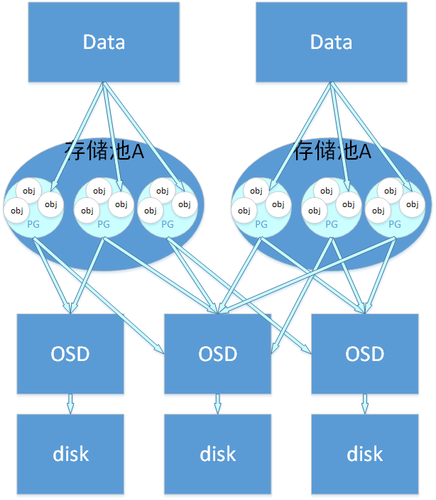

## 常用命令

获取ceph dashboard admin用户登录密码

```sh
kubectl -n rook-ceph get secret rook-ceph-dashboard-password -o jsonpath="{['data']['password']}" | base64 --decode && echo
```

连接rook-ceph-tools

```sh
kubectl -n rook-ceph exec -it $(kubectl -n rook-ceph get pod -l "app=rook-ceph-tools" -o jsonpath='{.items[0].metadata.name}') --- bash
```

